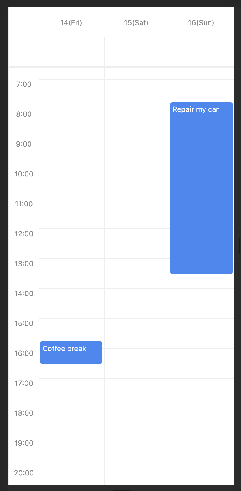

[](https://badge.fury.io/js/react-native-big-calendar)
[](https://app.netlify.com/sites/react-native-big-calendar/deploys)

**We use `Readme-Driven Development` so some part of features in this document has not been implemented yet.**

# react-native-big-calendar

Cross-platform gcal/outlook like calendar component for React Native.



# Features

- Cross Platform: Runs on Web, iOS, Android with the power of React
- Type-safe: Fully written in TypeScript
- Customizable: Render your custom components

# Install

```
npm install --save react-native-big-calendar
```

Or if you use Yarn:

```
yarn add react-native-big-calendar
```

# Getting Started

```typescript
import { Calendar } from 'react-native-big-calendar'

const events = [
  {
    title: 'Meeting',
    start: new Date(2020, 1, 11, 10, 0),
    end: new Date(2020, 1, 11, 10, 30),
  },
  {
    title: 'Coffee break',
    start: new Date(2020, 1, 11, 15, 45),
    end: new Date(2020, 1, 11, 16, 30),
  },
]

function App() {
  return <Calendar events={events} height={600} />
}
```

# Custom Components

```typescript
import {
  Calendar,
  EventCellProps,
  ToolbarProps,
  DateCellProps,
  NavigationActions,
} from 'react-native-big-calendar'
import { Text, TouchableOpacity, View } from 'react-native'

const events = [
  {
    title: 'Meeting',
    start: new Date(2020, 1, 11, 10, 0),
    end: new Date(2020, 1, 11, 10, 30),
  },
  {
    title: 'Coffee break',
    start: new Date(2020, 1, 18, 15, 45),
    end: new Date(2020, 1, 18, 16, 30),
  },
]

function Toolbar({ onNavigate, date }: ToolbarProps) {
  return (
    <View>
      <TouchableOpacity onPress={() => onNavigate(NavigationActions.PREV)}>
        <Text>Prev Week</Text>
      </TouchableOpacity>
      <Text>{date.toString()}</Text>
      <TouchableOpacity onPress={() => onNavigate(NavigationActions.NEXT)}>
        <Text>Next Week</Text>
      </TouchableOpacity>
      <TouchableOpacity onPress={() => onNavigate(NavigationActions.TODAY)}>
        <Text>Today</Text>
      </TouchableOpacity>
    </View>
  )
}

function DateCell({ range }: DateCellProps) {
  return range.map(dayjs => {
    return (
      <View key={dayjs.toString()}>
        {dayjs.format('d') === 0 && (
          <View style={{ backgroundColor: 'red', height: '100%', width: '100%' }} />
        )}
        {dayjs.format('d') === 6 && (
          <View style={{ backgroundColor: 'blue', height: '100%', width: '100%' }} />
        )}
      </View>
    )
  })
}

function EventCell({ event }: EventCellProps) {
  return (
    <View>
      <Text>{event.title}</Text>
    </View>
  )
}

function App() {
  return (
    <Calendar
      events={events}
      height={600}
      components={{
        toolbar: Toolbar,
        dateCellWrapper: DateCell,
        eventWrapper: EventCell,
      }}
    />
  )
}
```

# API

## <Calendar />

### `height` prop

type: `number`

The height of calendar component.

### `events` prop

type: `Array<{ title: string, start: Date | string, end: Date | string }>`

The array of events.

### `components` prop

type: `undefined |{ toolbar?: React.ComponentType<ToolbarProps>, dateCellWrapper?: React.ComponentType<DateCellProps>, eventWrapper?: React.ComponentType<EventCellProps> }`

Custom components which should be rendered instead of default components.
